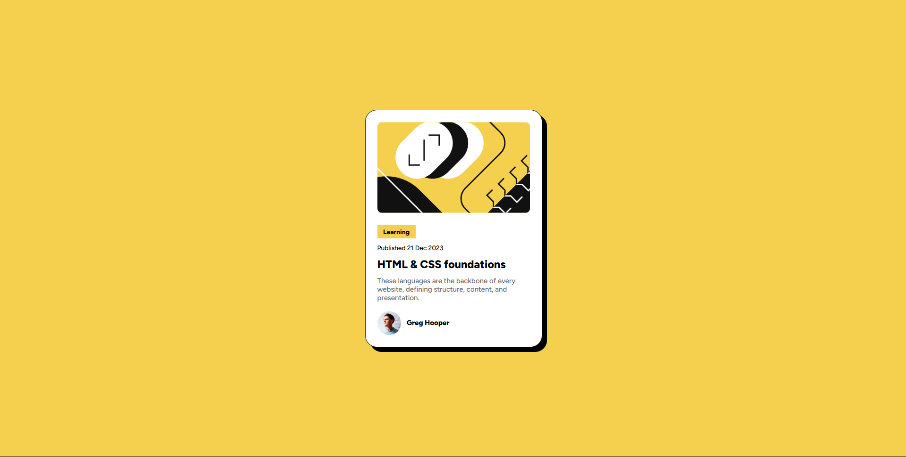

# Blog Preview Card – Solution

## Overview

This is my solution to the [Frontend Mentor - Blog preview card challenge](https://www.frontendmentor.io/challenges/blog-preview-card). The goal was to build a responsive blog preview card component using HTML and CSS, matching the provided design as closely as possible.

## Built With

- HTML5
- CSS3
- Flexbox
- [Frontend Mentor assets](https://www.frontendmentor.io/)

## What I Learned

- Improved my skills in responsive design and layout using Flexbox.
- Practiced using custom fonts and color palettes.
- Enhanced my understanding of hover and focus states for accessibility.

## Screenshot

## Live Demo

[View Live Site](https://audreylyn.github.io/Blog-preview-card/)

## Author

- GitHub: [YourUsername](https://github.com/audreylyn)

## Acknowledgments

Thanks to [Frontend Mentor](https://www.frontendmentor.io/) for the challenge and community support!

---

**Feel free to use this component in your own projects!**
